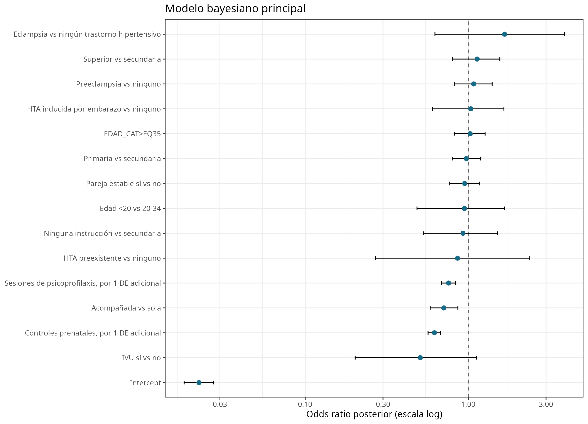
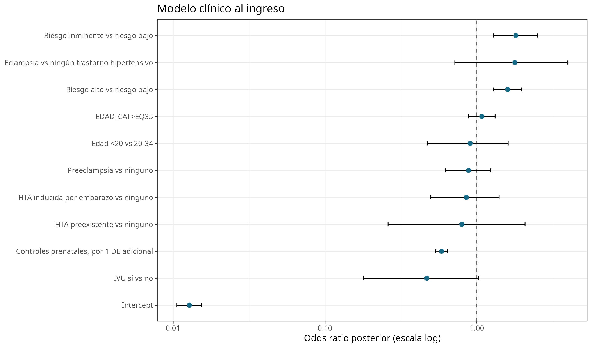
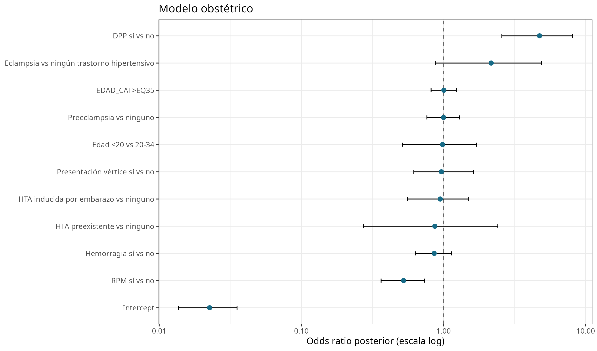
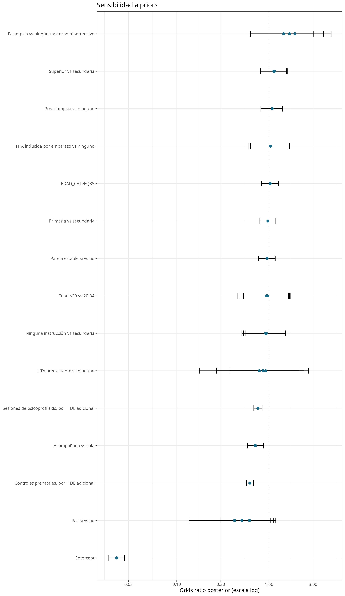
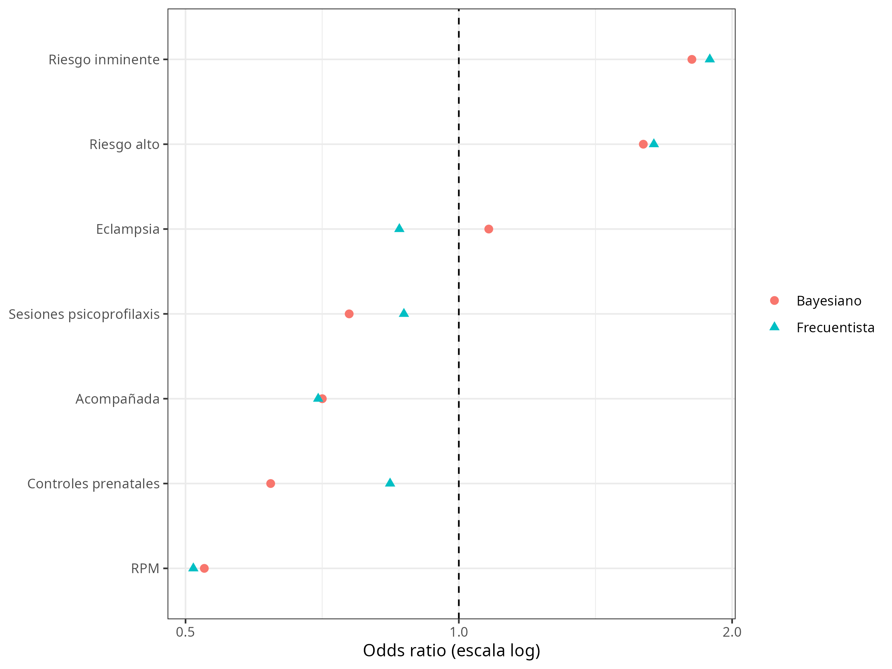

# 4. Resultados

## 4.1 Población analizada

De 23.848 registros, 23.642 tuvieron desenlace conocido: 489 correspondieron a muerte fetal y 23.153 a ausencia de muerte fetal; 206 registros tuvieron desenlace faltante. Entre los registros con desenlace disponible, la frecuencia relativa observada fue 2,07%.

## 4.2 Calidad y disponibilidad de los datos

Se trataron como faltantes 247 valores incompatibles de edad materna. Seguro tuvo 7.386 valores faltantes en la base original (aproximadamente 31%). En acompañamiento, 65 valores “0” se consideraron no interpretables. Los 206 registros de embarazo múltiple presentaron desenlace faltante, lo cual impidió estimar una asociación para esta variable.

## 4.3 Análisis descriptivo

Las características por desenlace se presentan en la Tabla 1. La distribución mostró heterogeneidad entre variables sociales, asistenciales, clínicas y obstétricas; se priorizó la interpretación de estimaciones ajustadas y su incertidumbre.

**Tabla 1. Características de los registros según desenlace.**

|Variable                                    |Categoria                    |MUERTE_FETAL_NO |MUERTE_FETAL_SI |
|:-------------------------------------------|:----------------------------|:---------------|:---------------|
|Pareja estable                              |NO                           |16105 (69.68%)  |350 (72.02%)    |
|Pareja estable                              |SI                           |7008 (69.68%)   |136 (72.02%)    |
|Instruccion                                 |SECUNDARIA                   |12702 (55.17%)  |264 (54.10%)    |
|Instruccion                                 |NINGUNA                      |622 (55.17%)    |13 (54.10%)     |
|Instruccion                                 |PRIMARIA                     |7617 (55.17%)   |170 (54.10%)    |
|Instruccion                                 |SUPERIOR                     |2084 (55.17%)   |41 (54.10%)     |
|Acompanada                                  |NO                           |5432 (23.53%)   |151 (31.13%)    |
|Acompanada                                  |SI                           |17654 (23.53%)  |334 (31.13%)    |
|Riesgo al ingreso                           |RIESGO BAJO                  |8473 (36.72%)   |128 (26.72%)    |
|Riesgo al ingreso                           |RIESGO ALTO                  |10789 (36.72%)  |253 (26.72%)    |
|Riesgo al ingreso                           |RIESGO INMINENTE             |3813 (36.72%)   |98 (26.72%)     |
|Infeccion de vias urinarias (IVU)           |NO                           |22849 (98.69%)  |487 (99.59%)    |
|Infeccion de vias urinarias (IVU)           |SI                           |304 (98.69%)    |2 (99.59%)      |
|Ruptura prematura de membranas (RPM)        |NO                           |20390 (88.07%)  |459 (93.87%)    |
|Ruptura prematura de membranas (RPM)        |SI                           |2763 (88.07%)   |30 (93.87%)     |
|Psicoprofilaxis (alguna)                    |NO                           |4002 (17.37%)   |168 (34.85%)    |
|Psicoprofilaxis (alguna)                    |SI                           |19042 (17.37%)  |314 (34.85%)    |
|Hemorragia                                  |NO                           |20517 (88.62%)  |439 (89.78%)    |
|Hemorragia                                  |SI                           |2635 (88.62%)   |50 (89.78%)     |
|Presentacion de vertice                     |NO                           |701 (3.03%)     |16 (3.27%)      |
|Presentacion de vertice                     |SI                           |22452 (3.03%)   |473 (3.27%)     |
|Trastornos hipertensivos                    |NINGUNO                      |19462 (84.06%)  |405 (82.82%)    |
|Trastornos hipertensivos                    |PREECLAMPSIA                 |2824 (84.06%)   |63 (82.82%)     |
|Trastornos hipertensivos                    |HTA INDUCIDA POR EL EMBARAZO |745 (84.06%)    |15 (82.82%)     |
|Trastornos hipertensivos                    |HTA PREEXISTENTE             |62 (84.06%)     |1 (82.82%)      |
|Trastornos hipertensivos                    |ECLAMPSIA                    |60 (84.06%)     |5 (82.82%)      |
|Desprendimiento prematuro de placenta (DPP) |NO                           |23043 (99.52%)  |474 (96.93%)    |
|Desprendimiento prematuro de placenta (DPP) |SI                           |110 (99.52%)    |15 (96.93%)     |

*Nota: Frecuencias derivadas de la base analítica frecuentista; los denominadores pueden variar por datos faltantes.*

## 4.4 Asociaciones crudas frecuentistas

Las asociaciones crudas se resumen en la Tabla 2. DPP, eclampsia y las categorías de riesgo al ingreso mostraron asociaciones positivas destacadas. Acompañamiento, mayor número de controles, mayor número de sesiones y RPM mostraron asociaciones negativas; estas direcciones no establecen temporalidad ni causalidad.

**Tabla 2. Asociaciones crudas con muerte fetal.**

|Variable                                    |Comparacion                  |Referencia  |OR_crudo |IC95       |p      |Metodo    |N_analizado |
|:-------------------------------------------|:----------------------------|:-----------|:--------|:----------|:------|:---------|:-----------|
|Pareja estable                              |SI                           |NO          |0.89     |0.73-1.09  |0.267  |Logistica |23599       |
|SEGURO_A                                    |SI                           |NO          |1.40     |0.94-2.09  |0.097  |Logistica |16306       |
|Instruccion                                 |NINGUNA                      |SECUNDARIA  |1.01     |0.57-1.77  |0.985  |Logistica |23513       |
|Instruccion                                 |PRIMARIA                     |SECUNDARIA  |1.07     |0.88-1.30  |0.474  |Logistica |23513       |
|Instruccion                                 |SUPERIOR                     |SECUNDARIA  |0.95     |0.68-1.32  |0.746  |Logistica |23513       |
|Acompanada                                  |SI                           |NO          |0.68     |0.56-0.83  |<0.001 |Logistica |23571       |
|Acompanamiento (detalle)                    |FAMILIAR                     |PAREJA      |0.84     |0.64-1.09  |0.195  |Logistica |23571       |
|Acompanamiento (detalle)                    |OTRO                         |PAREJA      |1.50     |1.15-1.96  |0.002  |Logistica |23571       |
|Acompanamiento (detalle)                    |SOLA                         |PAREJA      |1.53     |1.22-1.91  |<0.001 |Logistica |23571       |
|Riesgo al ingreso                           |RIESGO ALTO                  |RIESGO BAJO |1.55     |1.25-1.92  |<0.001 |Logistica |23554       |
|Riesgo al ingreso                           |RIESGO INMINENTE             |RIESGO BAJO |1.70     |1.30-2.22  |<0.001 |Logistica |23554       |
|Infeccion de vias urinarias (IVU)           |SI                           |NO          |0.31     |0.08-1.24  |0.098  |Fisher    |23642       |
|Ruptura prematura de membranas (RPM)        |SI                           |NO          |0.48     |0.33-0.70  |<0.001 |Logistica |23642       |
|Psicoprofilaxis (alguna)                    |SI                           |NO          |0.39     |0.32-0.48  |<0.001 |Logistica |23526       |
|Hemorragia                                  |SI                           |NO          |0.89     |0.66-1.19  |0.425  |Fisher    |23641       |
|Presentacion de vertice                     |SI                           |NO          |0.92     |0.56-1.53  |0.755  |Logistica |23642       |
|Trastornos hipertensivos                    |PREECLAMPSIA                 |NINGUNO     |1.07     |0.82-1.40  |0.611  |Logistica |23642       |
|Trastornos hipertensivos                    |HTA INDUCIDA POR EL EMBARAZO |NINGUNO     |0.97     |0.57-1.63  |0.901  |Logistica |23642       |
|Trastornos hipertensivos                    |HTA PREEXISTENTE             |NINGUNO     |0.78     |0.11-5.60  |0.801  |Logistica |23642       |
|Trastornos hipertensivos                    |ECLAMPSIA                    |NINGUNO     |4.00     |1.60-10.02 |0.003  |Logistica |23642       |
|Desprendimiento prematuro de placenta (DPP) |SI                           |NO          |6.63     |3.84-11.46 |<0.001 |Fisher    |23642       |

*Nota: OR: odds ratio; IC95%: intervalo de confianza del 95%. Las pruebas exactas completas se presentan en el suplemento.*

## 4.5 Modelos frecuentistas ajustados

En el modelo social y de atención, estar acompañada se asoció con menores odds (aOR 0,70; IC95% 0,58–0,86), al igual que cada control prenatal adicional (aOR 0,84; IC95% 0,81–0,87) y cada sesión adicional (aOR 0,87; IC95% 0,83–0,92). En el modelo clínico, riesgo alto tuvo aOR 1,64 (IC95% 1,32–2,03) y riesgo inminente aOR 1,89 (IC95% 1,33–2,69). En el modelo obstétrico, DPP tuvo aOR 6,25 (IC95% 3,59–10,87), eclampsia aOR 3,37 (IC95% 1,32–8,61) y RPM aOR 0,51 (IC95% 0,35–0,74).

**Tabla 3. Modelo frecuentista social y de atención prenatal.**

|Variable                                                         |aOR  |IC95      |p      |N_modelo |
|:----------------------------------------------------------------|:----|:---------|:------|:--------|
|Edad materna <20 vs 20-34                                        |0.97 |0.49-1.91 |0.933  |23095    |
|Edad materna >=35 vs 20-34                                       |1.03 |0.83-1.28 |0.786  |23095    |
|Pareja estable si vs no                                          |0.95 |0.77-1.17 |0.627  |23095    |
|Sin instruccion vs secundaria                                    |0.93 |0.53-1.64 |0.805  |23095    |
|Primaria vs secundaria                                           |0.97 |0.80-1.19 |0.801  |23095    |
|Superior vs secundaria                                           |1.16 |0.83-1.62 |0.398  |23095    |
|Acompanada vs sola                                               |0.70 |0.58-0.86 |<0.001 |23095    |
|Numero de controles prenatales, por cada control adicional       |0.84 |0.81-0.87 |<0.001 |23095    |
|Numero de sesiones de psicoprofilaxis, por cada sesion adicional |0.87 |0.83-0.92 |<0.001 |23095    |
|IVU si vs no                                                     |0.32 |0.08-1.29 |0.108  |23095    |

*Nota: aOR: odds ratio ajustado; IC95%: intervalo de confianza del 95%.*

**Tabla 4. Modelo frecuentista materno-clínico.**

|Variable                                                   |aOR  |IC95      |p      |N_modelo |
|:----------------------------------------------------------|:----|:---------|:------|:--------|
|Edad materna <20 vs 20-34                                  |0.90 |0.46-1.76 |0.756  |23272    |
|Edad materna >=35 vs 20-34                                 |1.08 |0.88-1.33 |0.449  |23272    |
|Preeclampsia vs ningun trastorno hipertensivo              |0.86 |0.60-1.24 |0.423  |23272    |
|HTA inducida por embarazo vs ninguno                       |0.84 |0.48-1.46 |0.530  |23272    |
|HTA preexistente vs ninguno                                |0.58 |0.08-4.25 |0.591  |23272    |
|Eclampsia vs ningun trastorno hipertensivo                 |2.46 |0.93-6.45 |0.068  |23272    |
|IVU si vs no                                               |0.27 |0.07-1.11 |0.070  |23272    |
|Riesgo alto vs riesgo bajo                                 |1.64 |1.32-2.03 |<0.001 |23272    |
|Riesgo inminente vs riesgo bajo                            |1.89 |1.33-2.69 |<0.001 |23272    |
|Numero de controles prenatales, por cada control adicional |0.82 |0.79-0.85 |<0.001 |23272    |

*Nota: aOR: odds ratio ajustado; IC95%: intervalo de confianza del 95%.*

**Tabla 5. Modelo frecuentista obstétrico.**

|Variable                                      |aOR  |IC95       |p      |N_modelo |
|:---------------------------------------------|:----|:----------|:------|:--------|
|Edad materna <20 vs 20-34                     |1.00 |0.51-1.96  |0.992  |23398    |
|Edad materna >=35 vs 20-34                    |1.01 |0.82-1.23  |0.960  |23398    |
|Preeclampsia vs ningun trastorno hipertensivo |1.00 |0.76-1.31  |1.000  |23398    |
|HTA inducida por embarazo vs ninguno          |0.96 |0.57-1.62  |0.887  |23398    |
|HTA preexistente vs ninguno                   |0.75 |0.10-5.44  |0.778  |23398    |
|Eclampsia vs ningun trastorno hipertensivo    |3.37 |1.32-8.61  |0.011  |23398    |
|RPM si vs no                                  |0.51 |0.35-0.74  |<0.001 |23398    |
|DPP si vs no                                  |6.25 |3.59-10.87 |<0.001 |23398    |
|Hemorragia si vs no                           |0.85 |0.63-1.16  |0.306  |23398    |
|Presentacion de vertice vs no vertice         |0.94 |0.57-1.56  |0.817  |23398    |

*Nota: aOR: odds ratio ajustado; IC95%: intervalo de confianza del 95%.*

## 4.6 Modelo bayesiano principal

El modelo principal incluyó 23.095 registros y 468 eventos. Se observaron asociaciones negativas para acompañamiento (OR posterior 0,71; CrI95% 0,58–0,86; P[OR<1]=1,000), controles por una desviación estándar (OR 0,62; CrI95% 0,57–0,68; P[OR<1]=1,000) y sesiones por una desviación estándar (OR 0,76; CrI95% 0,68–0,84; P[OR<1]=1,000). Para IVU, la mediana fue 0,51, con CrI95% 0,20–1,12 y P(OR<1)=0,950. Para eclampsia, el OR fue 1,67 (CrI95% 0,62–3,89; P[OR>1]=0,853). Las restantes estimaciones se presentan en la Tabla 6.

**Tabla 6. Modelo bayesiano principal.**

|Factor                                          |OR posterior (CrI95%) |P(OR>1) |P(OR<1) |N     |
|:-----------------------------------------------|:---------------------|:-------|:-------|:-----|
|Edad <20 vs 20-34                               |0,95 (0,48–1,67)      |0,432   |0,568   |23095 |
|EDAD_CAT>EQ35                                   |1,03 (0,83–1,27)      |0,600   |0,400   |23095 |
|Preeclampsia vs ninguno                         |1,08 (0,82–1,40)      |0,712   |0,288   |23095 |
|HTA inducida por embarazo vs ninguno            |1,04 (0,60–1,66)      |0,554   |0,446   |23095 |
|HTA preexistente vs ninguno                     |0,86 (0,27–2,39)      |0,391   |0,610   |23095 |
|Eclampsia vs ningún trastorno hipertensivo      |1,67 (0,62–3,89)      |0,853   |0,147   |23095 |
|Pareja estable sí vs no                         |0,95 (0,77–1,17)      |0,327   |0,673   |23095 |
|Ninguna instrucción vs secundaria               |0,93 (0,53–1,51)      |0,384   |0,616   |23095 |
|Primaria vs secundaria                          |0,97 (0,80–1,19)      |0,397   |0,603   |23095 |
|Superior vs secundaria                          |1,13 (0,80–1,56)      |0,771   |0,229   |23095 |
|Acompañada vs sola                              |0,71 (0,58–0,86)      |<0,001  |1,000   |23095 |
|Controles prenatales, por 1 DE adicional        |0,62 (0,57–0,68)      |<0,001  |1,000   |23095 |
|Sesiones de psicoprofilaxis, por 1 DE adicional |0,76 (0,68–0,84)      |<0,001  |1,000   |23095 |
|IVU sí vs no                                    |0,51 (0,20–1,12)      |0,050   |0,950   |23095 |

*Nota: Estimaciones: medianas posteriores; CrI95%: intervalo creíble del 95%. Los predictores continuos se expresan por 1 DE.*

{width=85%}

*Figura 1. Forest plot del modelo bayesiano principal. La línea vertical en OR=1 representa ausencia de asociación; los puntos son medianas posteriores y las barras CrI95%.*

## 4.7 Modelo clínico bayesiano

Riesgo alto se asoció con mayores odds (OR posterior 1,60; CrI95% 1,29–1,98; P[OR>1]=1,000) y riesgo inminente mostró una asociación positiva de mayor magnitud (OR 1,81; CrI95% 1,29–2,51; P[OR>1]=1,000). Estas variables se interpretaron como marcadores de gravedad clínica al ingreso.

**Tabla 7. Modelo bayesiano clínico al ingreso.**

|Factor                                     |OR posterior (CrI95%) |P(OR>1) |P(OR<1) |N     |
|:------------------------------------------|:---------------------|:-------|:-------|:-----|
|Edad <20 vs 20-34                          |0,90 (0,47–1,61)      |0,373   |0,627   |23272 |
|EDAD_CAT>EQ35                              |1,08 (0,88–1,32)      |0,770   |0,230   |23272 |
|Preeclampsia vs ninguno                    |0,88 (0,62–1,24)      |0,229   |0,771   |23272 |
|HTA inducida por embarazo vs ninguno       |0,85 (0,50–1,40)      |0,263   |0,737   |23272 |
|HTA preexistente vs ninguno                |0,79 (0,26–2,08)      |0,328   |0,672   |23272 |
|Eclampsia vs ningún trastorno hipertensivo |1,78 (0,72–3,98)      |0,898   |0,102   |23272 |
|IVU sí vs no                               |0,47 (0,18–1,03)      |0,030   |0,970   |23272 |
|Riesgo alto vs riesgo bajo                 |1,60 (1,29–1,98)      |1,000   |<0,001  |23272 |
|Riesgo inminente vs riesgo bajo            |1,81 (1,29–2,51)      |1,000   |<0,001  |23272 |
|Controles prenatales, por 1 DE adicional   |0,59 (0,54–0,64)      |<0,001  |1,000   |23272 |

*Nota: El riesgo al ingreso es un marcador clínico y no una exposición causal demostrada.*

{width=85%}

*Figura 2. Forest plot del modelo clínico bayesiano. Medianas posteriores y CrI95%; línea de referencia en OR=1.*

## 4.8 Modelo obstétrico bayesiano

DPP mostró la asociación positiva de mayor magnitud (OR posterior 4,73; CrI95% 2,57–8,10; P[OR>1]=1,000). Para eclampsia, el OR posterior fue 2,16 (CrI95% 0,87–4,89): aunque el CrI95% incluyó 1, el 95,2% de la masa posterior se ubicó en OR>1. RPM mostró una asociación negativa (OR 0,52; CrI95% 0,36–0,74; P[OR<1]=1,000), que no debe interpretarse automáticamente como efecto preventivo por la posible temporalidad inversa y las diferencias de registro clínico.

**Tabla 8. Modelo bayesiano de complicaciones obstétricas.**

|Factor                                     |OR posterior (CrI95%) |P(OR>1) |P(OR<1) |N     |
|:------------------------------------------|:---------------------|:-------|:-------|:-----|
|Edad <20 vs 20-34                          |0,99 (0,51–1,71)      |0,481   |0,519   |23398 |
|EDAD_CAT>EQ35                              |1,01 (0,82–1,23)      |0,520   |0,479   |23398 |
|Preeclampsia vs ninguno                    |1,00 (0,76–1,30)      |0,505   |0,494   |23398 |
|HTA inducida por embarazo vs ninguno       |0,95 (0,56–1,49)      |0,416   |0,584   |23398 |
|HTA preexistente vs ninguno                |0,87 (0,27–2,41)      |0,401   |0,599   |23398 |
|Eclampsia vs ningún trastorno hipertensivo |2,16 (0,87–4,89)      |0,952   |0,048   |23398 |
|RPM sí vs no                               |0,52 (0,36–0,73)      |<0,001  |1,000   |23398 |
|DPP sí vs no                               |4,73 (2,57–8,10)      |1,000   |<0,001  |23398 |
|Hemorragia sí vs no                        |0,86 (0,63–1,14)      |0,154   |0,846   |23398 |
|Presentación vértice sí vs no              |0,97 (0,62–1,63)      |0,449   |0,551   |23398 |

*Nota: DPP: desprendimiento prematuro de placenta; RPM: ruptura prematura de membranas.*

{width=85%}

*Figura 3. Forest plot del modelo obstétrico bayesiano. Medianas posteriores y CrI95%; línea de referencia en OR=1.*

## 4.9 Atención prenatal, psicoprofilaxis y acompañamiento

Las asociaciones negativas de controles, sesiones y acompañamiento permanecieron claras en el modelo principal. Al ajustar por edad gestacional, la estimación para controles se atenuó a OR 0,80 (CrI95% 0,72–0,89), la correspondiente a sesiones se aproximó a 1 (OR 0,93; CrI95% 0,84–1,04) y acompañamiento también se aproximó a 1 (OR 0,99; CrI95% 0,79–1,25). Esta variación muestra dependencia de la especificación y es compatible con confusión por tiempo gestacional disponible.

## 4.10 Análisis de sensibilidad

Los priors alternativos conservaron prácticamente las estimaciones de acompañamiento, controles y sesiones; para eclampsia, la mediana varió entre 1,44 y 1,91 y mantuvo intervalos amplios. La edad continua produjo estimaciones similares a las del modelo principal. La sensibilidad con edad gestacional modificó varias asociaciones asistenciales, como se indicó antes, por lo que no se consideró estabilidad completa frente a esta especificación. La agrupación preeclampsia/eclampsia produjo OR 1,12 (CrI95% 0,86–1,45; P[OR>1]=0,801). En casos completos, seguro sí vs no tuvo OR 1,31 (CrI95% 0,85–1,94; P[OR>1]=0,892; N=15.924), con pérdida de 32,6% respecto de los registros con desenlace conocido. En acompañamiento detallado, sola vs pareja tuvo OR 1,41 (CrI95% 1,13–1,79; P[OR>1]=0,998).

**Tabla 9. Análisis de sensibilidad bayesiano condensado.**

|Análisis                      |Factor                                          |OR   |CrI95     |P_dirección |
|:-----------------------------|:-----------------------------------------------|:----|:---------|:-----------|
|Prior Principal               |Eclampsia vs ningún trastorno hipertensivo      |1,67 |0,62–3,89 |0,853       |
|Prior Principal               |Acompañada vs sola                              |0,71 |0,58–0,86 |1,000       |
|Prior Principal               |Controles prenatales, por 1 DE adicional        |0,62 |0,57–0,68 |1,000       |
|Prior Principal               |Sesiones de psicoprofilaxis, por 1 DE adicional |0,76 |0,68–0,84 |1,000       |
|Prior Escéptico               |Eclampsia vs ningún trastorno hipertensivo      |1,44 |0,64–3,01 |0,812       |
|Prior Escéptico               |Acompañada vs sola                              |0,71 |0,59–0,87 |1,000       |
|Prior Escéptico               |Controles prenatales, por 1 DE adicional        |0,62 |0,57–0,68 |1,000       |
|Prior Escéptico               |Sesiones de psicoprofilaxis, por 1 DE adicional |0,76 |0,69–0,84 |1,000       |
|Prior Amplio                  |Eclampsia vs ningún trastorno hipertensivo      |1,91 |0,63–4,71 |0,886       |
|Prior Amplio                  |Acompañada vs sola                              |0,70 |0,58–0,86 |0,999       |
|Prior Amplio                  |Controles prenatales, por 1 DE adicional        |0,62 |0,57–0,68 |1,000       |
|Prior Amplio                  |Sesiones de psicoprofilaxis, por 1 DE adicional |0,76 |0,68–0,84 |1,000       |
|Ajustado por edad gestacional |Acompañada vs sola                              |0,99 |0,79–1,25 |0,532       |
|Ajustado por edad gestacional |Controles prenatales, por 1 DE adicional        |0,80 |0,72–0,89 |1,000       |
|Ajustado por edad gestacional |Sesiones de psicoprofilaxis, por 1 DE adicional |0,93 |0,83–1,04 |0,904       |
|Ajustado por edad gestacional |Edad gestacional, por 1 DE adicional            |0,57 |0,54–0,60 |1,000       |
|Hipertensión agrupada         |Preeclampsia/eclampsia vs ninguno               |1,12 |0,86–1,45 |0,801       |
|Seguro, casos completos       |Seguro sí vs no                                 |1,31 |0,85–1,94 |0,892       |
|Acompañamiento detallado      |Familiar vs pareja                              |0,81 |0,61–1,06 |0,943       |
|Acompañamiento detallado      |Otro vs pareja                                  |1,26 |0,96–1,65 |0,953       |
|Acompañamiento detallado      |Sola vs pareja                                  |1,41 |1,13–1,79 |0,998       |

*Nota: Se muestran estimaciones seleccionadas; las tablas completas están en el suplemento.*

{width=85%}

*Figura 4. Sensibilidad de las estimaciones a los priors. Comparación de medianas posteriores y CrI95% bajo tres esquemas preespecificados.*

## 4.11 Diagnóstico de modelos bayesianos

Se ajustaron diez modelos. El R-hat máximo fue 1,0013; el ESS bulk mínimo fue 8.664 y el ESS tail mínimo 7.153. No se observaron divergencias ni excedencias de profundidad de árbol registradas. Las trazas y los gráficos de rango no mostraron patrones visuales importantes de falta de mezcla. Los chequeos predictivos posteriores compararon el número de eventos observado con réplicas de la distribución posterior; no revelaron discrepancias globales evidentes para ese estadístico, aunque estos chequeos no demuestran por sí solos adecuación en todas las dimensiones.

**Tabla 11. Diagnósticos de los modelos bayesianos.**

|Modelo                       |N     |Eventos |R-hat máximo |ESS bulk mínimo |ESS tail mínimo |Divergencias |Estado |
|:----------------------------|:-----|:-------|:------------|:---------------|:---------------|:------------|:------|
|BAYES_ACOMPANAMIENTO_DETALLE |23095 |468     |1.001        |8664            |8157            |0            |OK     |
|BAYES_CLINICO_INGRESO        |23272 |471     |1.001        |8880            |7618            |0            |OK     |
|BAYES_HIPERTENSION_AGRUPADA  |23095 |468     |1.001        |11825           |7885            |0            |OK     |
|BAYES_OBSTETRICO             |23398 |480     |1.001        |12800           |7939            |0            |OK     |
|BAYES_PRINCIPAL              |23095 |468     |1.001        |12215           |8037            |0            |OK     |
|BAYES_PRIOR_AMPLIO           |23095 |468     |1.001        |9953            |7153            |0            |OK     |
|BAYES_PRIOR_ESCEPTICO        |23095 |468     |1.001        |11829           |7868            |0            |OK     |
|BAYES_SEGURO_SENSIBILIDAD    |15924 |324     |1.001        |11732           |7902            |0            |OK     |
|BAYES_SENS_EDAD_CONTINUA     |23095 |468     |1.001        |10870           |7341            |0            |OK     |
|BAYES_SENS_EDAD_GESTACIONAL  |22963 |404     |1.001        |10868           |7616            |0            |OK     |

*Nota: Estado OK requirió R-hat ≤1,01 y cero divergencias; ESS se presenta para los parámetros principales.*

## 4.12 Comparación frecuentista-bayesiana

Los enfoques coincidieron en la dirección de DPP, riesgo alto e inminente, acompañamiento, controles, psicoprofilaxis y RPM. La estimación bayesiana obstétrica de eclampsia fue positiva pero más regularizada y más incierta que la estimación frecuentista. Las probabilidades posteriores describen masa de la distribución y no son equivalentes a p-valores.

**Tabla 10. Comparación de resultados frecuentistas y bayesianos.**

|Factor               |OR frecuentista (IC95%) |p      |OR bayesiano (CrI95%) |P dirección |Modelo     |
|:--------------------|:-----------------------|:------|:---------------------|:-----------|:----------|
|DPP                  |6.25 (3.59–10.87)       |<0,001 |4,73 (2,57–8,10)      |1,000       |Obstétrico |
|Eclampsia            |0.86 (0.60–1.24)        |0,423  |1,08 (0,82–1,40)      |0,712       |Obstétrico |
|Riesgo alto          |1.64 (1.32–2.03)        |<0,001 |1,60 (1,29–1,98)      |1,000       |Clínico    |
|Riesgo inminente     |1.89 (1.33–2.69)        |<0,001 |1,81 (1,29–2,51)      |1,000       |Clínico    |
|Acompañamiento       |0.7 (0.58–0.86)         |<0,001 |0,71 (0,58–0,86)      |1,000       |Principal  |
|Controles prenatales |0.84 (0.81–0.87)        |<0,001 |0,62 (0,57–0,68)      |1,000       |Principal  |
|Psicoprofilaxis      |0.87 (0.83–0.92)        |<0,001 |0,76 (0,68–0,84)      |1,000       |Principal  |
|RPM                  |0.51 (0.35–0.74)        |<0,001 |0,52 (0,36–0,73)      |1,000       |Obstétrico |

*Nota: IC95% corresponde al análisis frecuentista; CrI95% al bayesiano. No deben interpretarse p y P dirección como medidas equivalentes.*

{width=85%}

*Figura 5. Comparación frecuentista y bayesiana. Se comparan estimaciones puntuales en escala logarítmica; las diferencias reflejan especificaciones y regularización.*

