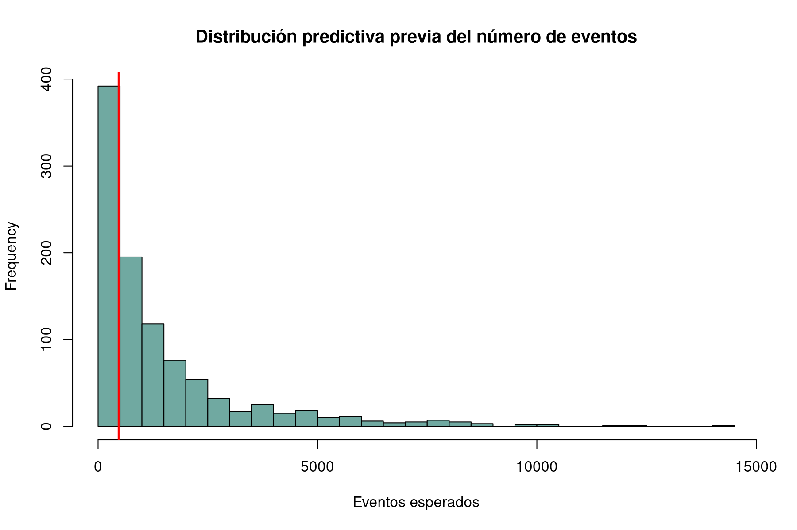
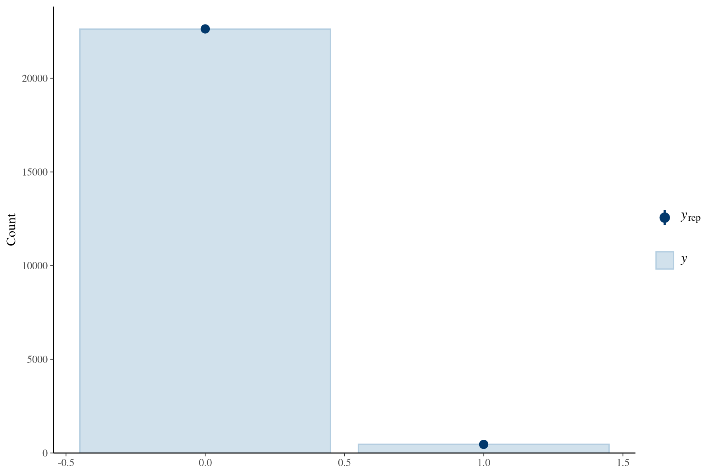
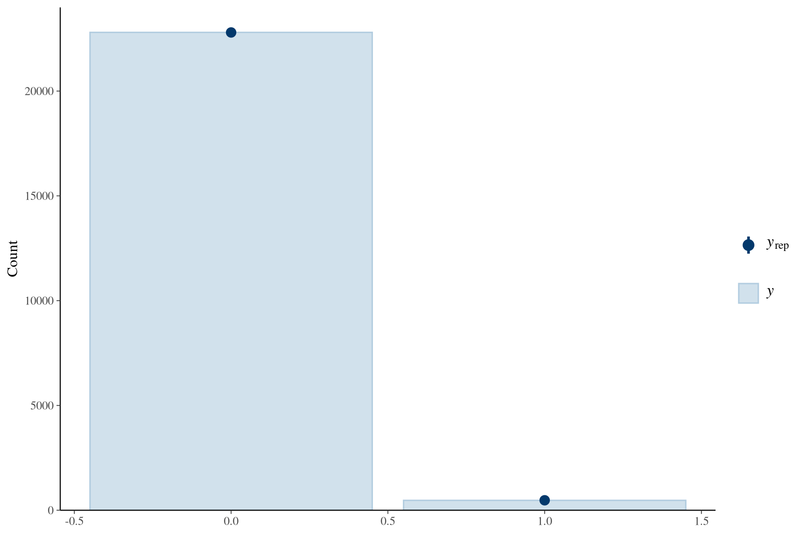
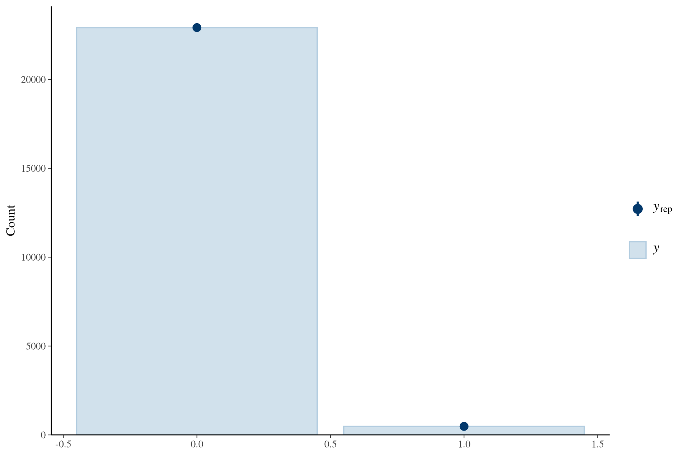
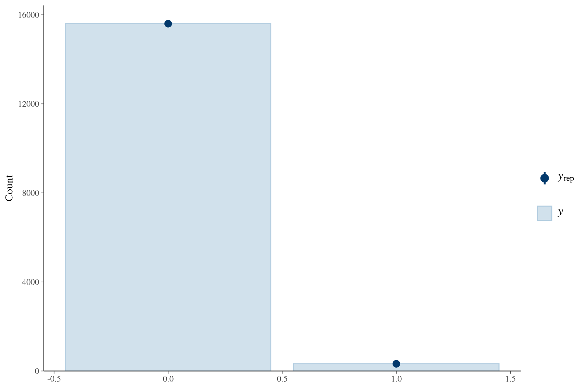
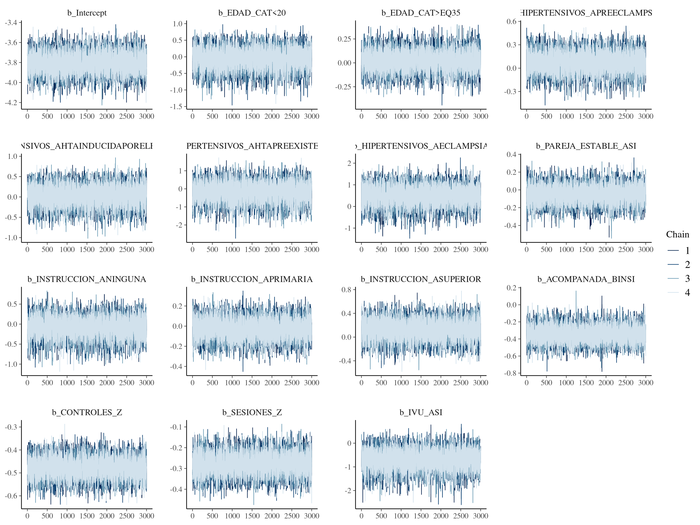
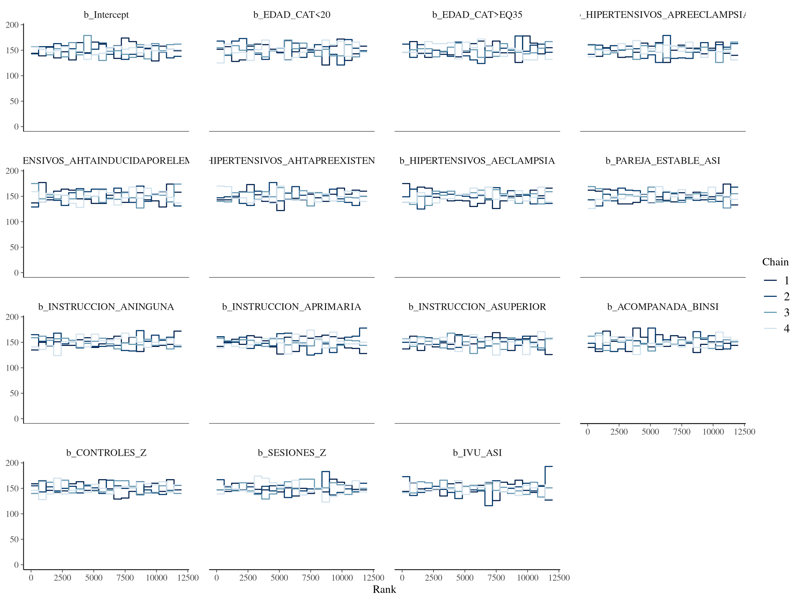

# Métodos ampliados

## 3.1 Diseño del estudio

Estudio transversal analítico basado en registros. No se asumió seguimiento longitudinal ni se formularon efectos causales.

## 3.2 Fuente de datos y escenario

Se utilizó la base analítica derivada de los registros disponibles en [COMPLETAR: institución, ciudad y país] durante [COMPLETAR: periodo]. La fuente primaria exacta, el proceso institucional de captura y los responsables del registro deben completarse antes del envío.

## 3.3 Población y unidad de análisis

La base contenía 23.848 registros fetales. Se incluyeron 23.642 con desenlace conocido en los análisis de muerte fetal; 206 tenían desenlace faltante. La unidad de análisis fue el registro fetal. Los 206 registros identificados como embarazo múltiple coincidieron con desenlace faltante, por lo que no fue posible estimar su OR.

## 3.4 Desenlace

El desenlace fue MUERTE_FETAL_BINARIA, codificado como 0 (no) y 1 (sí), derivado de la variable de muerte intrauterina según el pipeline analítico documentado. Los valores sin clasificación se mantuvieron como faltantes.

## 3.5 Variables

Las variables maternas fueron edad, trastornos hipertensivos e infección de vías urinarias (IVU); las sociales fueron pareja estable, instrucción, acompañamiento y seguro; las de atención fueron controles prenatales y sesiones de psicoprofilaxis; la variable clínica fue riesgo al ingreso; y las obstétricas fueron RPM, DPP, hemorragia y presentación fetal.

## 3.6 Control de calidad y recodificación

EDAD_ANALITICA se construyó sin modificar EDAD_NUM: valores menores de 10 o mayores de 60 años se trataron como faltantes (247 registros). Su rango fue 10–58 años, media 30,49 y mediana 30; las categorías fueron 20–34 años (referencia), <20 y ≥35 años. En SCORE_ANALITICO, valores >20 fueron tratados como faltantes; el máximo analítico fue 12 y hubo 56 faltantes. EDAD_GESTACIONAL_ANALITICA varió entre 20 y 42,6 semanas y tuvo 194 faltantes. En acompañamiento, “SOLA” se codificó como no acompañada; pareja, familiar u otro como acompañada; y “0” como faltante por no ser interpretable. Seguro presentó cerca de 31% de faltantes y se reservó para sensibilidad de casos completos.

## 3.7 Datos faltantes

No se realizó imputación múltiple. Cada modelo utilizó casos con desenlace y covariables completas para su fórmula. Por ello, el tamaño analítico varió entre modelos y no se compararon directamente mediante LOO modelos basados en conjuntos diferentes de observaciones.

## 3.8 Análisis descriptivo y frecuentista

Se calcularon frecuencias absolutas y relativas para variables categóricas y resúmenes de variables continuas. La proporción de muertes fetales entre registros con desenlace conocido se describió como frecuencia relativa del desenlace. Se estimaron OR crudos con IC95%, pruebas de chi-cuadrado y pruebas exactas de Fisher para exposiciones escasas. Se ajustaron regresiones logísticas por dominios: A, social/atención prenatal; B, materno-clínico; C, obstétrico; y D, seguro como sensibilidad.

## 3.9 Análisis bayesiano

El modelo principal fue: MUERTE_FETAL_BINARIA ~ EDAD_CAT + HIPERTENSIVOS_A + PAREJA_ESTABLE_A + INSTRUCCION_A + ACOMPANADA_BIN + CONTROLES_Z + SESIONES_Z + IVU_A. Se empleó regresión logística bayesiana con familia Bernoulli y enlace logit. Controles, sesiones y demás predictores continuos incluidos se estandarizaron.

## 3.10 Priors e inferencia

Para los coeficientes se especificó Normal(0; 0,7), centrado en beta=0/OR=1 y simétrico. Aproximadamente 95% de su masa corresponde a OR de 0,25–3,94. El intercepto tuvo Normal(−4; 1,5). Se evaluaron sensibilidades Normal(0; 0,5), con intercepto Normal(−4; 1), y Normal(0; 1), con intercepto Normal(−4; 2). Los priors no se construyeron con OR frecuentistas de la misma base. Se informó la mediana de exp(beta), CrI95% y P(OR>1) o P(OR<1). Una probabilidad posterior como 0,952 no es un p-valor.

## 3.11 Muestreo, chequeos y sensibilidad

Los modelos se ajustaron con cuatro cadenas, 4.000 iteraciones por cadena, 2.000 de calentamiento, semilla 20260810, adapt_delta=0,99 y max_treedepth=15. La función preespecificada contempló reintentos más conservadores; los modelos finales no requirieron advertencias de convergencia. Se realizaron 1.000 simulaciones predictivas previas y chequeos predictivos posteriores. Se evaluaron R-hat, ESS bulk/tail, divergencias, profundidad de árbol, trazas y gráficos de rango.

Las sensibilidades ejecutadas fueron: priors alternativos; edad continua estandarizada; ajuste por edad gestacional; modelo clínico de riesgo al ingreso; modelo obstétrico; hipertensión agrupada; seguro en casos completos; y acompañamiento detallado.

## 3.12 Software

Se utilizó R 4.5.0, brms 2.23.0, cmdstanr y CmdStan 2.39.0.

## 3.13 Aspectos éticos

[COMPLETAR: comité de ética]. [COMPLETAR: número de aprobación]. [COMPLETAR: tratamiento de datos anonimizados y dispensa de consentimiento, si correspondió].

# Tabla S1. Priors especificados

|Modelo             |Parametro    |Prior          |Media |SD  |OR_2.5    |OR_97.5  |Uso          |
|:------------------|:------------|:--------------|:-----|:---|:---------|:--------|:------------|
|Principal          |Coeficientes |normal(0,0.7)  |0     |0.7 |0.2535993 |3.943229 |Principal    |
|Principal          |Intercepto   |normal(-4,1.5) |-4    |1.5 |NA        |NA       |Principal    |
|Sensible_esceptico |Coeficientes |normal(0,0.5)  |0     |0.5 |0.3753111 |2.664456 |Sensibilidad |
|Sensible_esceptico |Intercepto   |normal(-4,1)   |-4    |1.0 |NA        |NA       |Sensibilidad |
|Sensible_amplio    |Coeficientes |normal(0,1)    |0     |1.0 |0.1408584 |7.099327 |Sensibilidad |
|Sensible_amplio    |Intercepto   |normal(-4,2)   |-4    |2.0 |NA        |NA       |Sensibilidad |

# Tabla S2. Sensibilidad completa a priors

|Parametro                                 |Variable                                        |Comparacion                                     |Referencia |beta_mediana |beta_media |SD_posterior |OR_posterior |CrI95_inf |CrI95_sup |P_OR_mayor_1 |P_OR_menor_1 |Rhat  |ESS_bulk |ESS_tail |N_modelo |Modelo    |
|:-----------------------------------------|:-----------------------------------------------|:-----------------------------------------------|:----------|:------------|:----------|:------------|:------------|:---------|:---------|:------------|:------------|:-----|:--------|:--------|:--------|:---------|
|b_Intercept                               |Intercept                                       |Intercept                                       |NO         |-3.803       |-3.803     |0.106        |0.022        |0.018     |0.027     |0.000        |1.000        |1.000 |16248.45 |9362.004 |23095    |Principal |
|b_EDAD_CAT<20                             |Edad <20 vs 20-34                               |Edad <20 vs 20-34                               |20-34      |-0.055       |-0.067     |0.318        |0.947        |0.485     |1.671     |0.432        |0.568        |1.000 |17169.55 |8037.231 |23095    |Principal |
|b_EDAD_CAT>EQ35                           |EDAD_CAT>EQ35                                   |EDAD_CAT>EQ35                                   |20-34      |0.028        |0.026      |0.108        |1.028        |0.825     |1.269     |0.600        |0.400        |1.000 |16504.68 |9039.568 |23095    |Principal |
|b_HIPERTENSIVOS_APREECLAMPSIA             |Preeclampsia vs ninguno                         |Preeclampsia vs ninguno                         |NINGUNO    |0.076        |0.074      |0.137        |1.079        |0.821     |1.401     |0.712        |0.288        |1.000 |16367.25 |8571.695 |23095    |Principal |
|b_HIPERTENSIVOS_AHTAINDUCIDAPORELEMBARAZO |HTA inducida por embarazo vs ninguno            |HTA inducida por embarazo vs ninguno            |NINGUNO    |0.036        |0.027      |0.256        |1.037        |0.605     |1.655     |0.554        |0.446        |1.001 |15749.24 |8422.078 |23095    |Principal |
|b_HIPERTENSIVOS_AHTAPREEXISTENTE          |HTA preexistente vs ninguno                     |HTA preexistente vs ninguno                     |NINGUNO    |-0.151       |-0.169     |0.554        |0.860        |0.270     |2.386     |0.390        |0.610        |1.001 |15629.95 |8882.526 |23095    |Principal |
|b_HIPERTENSIVOS_AECLAMPSIA                |Eclampsia vs ningún trastorno hipertensivo      |Eclampsia vs ningún trastorno hipertensivo      |NINGUNO    |0.513        |0.491      |0.465        |1.671        |0.625     |3.891     |0.853        |0.147        |1.001 |16829.15 |8303.067 |23095    |Principal |
|b_PAREJA_ESTABLE_ASI                      |Pareja estable sí vs no                         |Pareja estable sí vs no                         |NO         |-0.049       |-0.050     |0.108        |0.952        |0.770     |1.168     |0.327        |0.673        |1.000 |15447.19 |8618.502 |23095    |Principal |
|b_INSTRUCCION_ANINGUNA                    |Ninguna instrucción vs secundaria               |Ninguna instrucción vs secundaria               |SECUNDARIA |-0.075       |-0.085     |0.267        |0.928        |0.530     |1.511     |0.384        |0.616        |1.000 |16747.34 |8488.862 |23095    |Principal |
|b_INSTRUCCION_APRIMARIA                   |Primaria vs secundaria                          |Primaria vs secundaria                          |SECUNDARIA |-0.028       |-0.027     |0.104        |0.972        |0.797     |1.189     |0.397        |0.603        |1.000 |15093.70 |9154.005 |23095    |Principal |
|b_INSTRUCCION_ASUPERIOR                   |Superior vs secundaria                          |Superior vs secundaria                          |SECUNDARIA |0.126        |0.124      |0.170        |1.135        |0.800     |1.562     |0.771        |0.229        |1.000 |15903.89 |9424.938 |23095    |Principal |
|b_ACOMPANADA_BINSI                        |Acompañada vs sola                              |Acompañada vs sola                              |NO         |-0.346       |-0.345     |0.101        |0.707        |0.584     |0.864     |0.000        |1.000        |1.001 |17145.37 |8492.236 |23095    |Principal |
|b_CONTROLES_Z                             |Controles prenatales, por 1 DE adicional        |Controles prenatales, por 1 DE adicional        |Por 1 DE   |-0.477       |-0.478     |0.046        |0.621        |0.567     |0.678     |0.000        |1.000        |1.000 |13443.41 |9382.509 |23095    |Principal |
|b_SESIONES_Z                              |Sesiones de psicoprofilaxis, por 1 DE adicional |Sesiones de psicoprofilaxis, por 1 DE adicional |Por 1 DE   |-0.278       |-0.278     |0.052        |0.757        |0.683     |0.839     |0.000        |1.000        |1.000 |15079.75 |8639.272 |23095    |Principal |
|b_IVU_ASI                                 |IVU sí vs no                                    |IVU sí vs no                                    |NO         |-0.678       |-0.694     |0.440        |0.508        |0.202     |1.123     |0.050        |0.950        |1.000 |16781.28 |8434.148 |23095    |Principal |
|b_Intercept                               |Intercept                                       |Intercept                                       |NO         |-3.806       |-3.806     |0.104        |0.022        |0.018     |0.027     |0.000        |1.000        |1.000 |15611.45 |9264.934 |23095    |Escéptico |
|b_EDAD_CAT<20                             |Edad <20 vs 20-34                               |Edad <20 vs 20-34                               |20-34      |-0.037       |-0.048     |0.288        |0.964        |0.529     |1.630     |0.446        |0.554        |1.000 |13689.90 |8097.342 |23095    |Escéptico |
|b_EDAD_CAT>EQ35                           |EDAD_CAT>EQ35                                   |EDAD_CAT>EQ35                                   |20-34      |0.026        |0.026      |0.109        |1.026        |0.827     |1.266     |0.593        |0.407        |1.000 |14020.00 |8419.051 |23095    |Escéptico |
|b_HIPERTENSIVOS_APREECLAMPSIA             |Preeclampsia vs ninguno                         |Preeclampsia vs ninguno                         |NINGUNO    |0.076        |0.073      |0.136        |1.079        |0.815     |1.396     |0.708        |0.292        |1.000 |13700.29 |8596.984 |23095    |Escéptico |
|b_HIPERTENSIVOS_AHTAINDUCIDAPORELEMBARAZO |HTA inducida por embarazo vs ninguno            |HTA inducida por embarazo vs ninguno            |NINGUNO    |0.031        |0.024      |0.240        |1.031        |0.630     |1.605     |0.554        |0.446        |1.001 |14201.10 |8268.095 |23095    |Escéptico |
|b_HIPERTENSIVOS_AHTAPREEXISTENTE          |HTA preexistente vs ninguno                     |HTA preexistente vs ninguno                     |NINGUNO    |-0.086       |-0.096     |0.440        |0.917        |0.378     |2.108     |0.419        |0.581        |1.000 |13973.02 |8464.880 |23095    |Escéptico |
|b_HIPERTENSIVOS_AECLAMPSIA                |Eclampsia vs ningún trastorno hipertensivo      |Eclampsia vs ningún trastorno hipertensivo      |NINGUNO    |0.366        |0.354      |0.397        |1.442        |0.639     |3.015     |0.812        |0.188        |1.000 |14378.80 |8372.688 |23095    |Escéptico |
|b_PAREJA_ESTABLE_ASI                      |Pareja estable sí vs no                         |Pareja estable sí vs no                         |NO         |-0.051       |-0.051     |0.105        |0.950        |0.771     |1.163     |0.317        |0.683        |1.000 |14110.15 |8655.945 |23095    |Escéptico |
|b_INSTRUCCION_ANINGUNA                    |Ninguna instrucción vs secundaria               |Ninguna instrucción vs secundaria               |SECUNDARIA |-0.068       |-0.074     |0.249        |0.935        |0.560     |1.491     |0.392        |0.608        |1.000 |12987.52 |7867.761 |23095    |Escéptico |
|b_INSTRUCCION_APRIMARIA                   |Primaria vs secundaria                          |Primaria vs secundaria                          |SECUNDARIA |-0.028       |-0.028     |0.101        |0.973        |0.796     |1.183     |0.393        |0.607        |1.000 |13485.94 |8689.747 |23095    |Escéptico |
|b_INSTRUCCION_ASUPERIOR                   |Superior vs secundaria                          |Superior vs secundaria                          |SECUNDARIA |0.119        |0.115      |0.166        |1.126        |0.805     |1.540     |0.753        |0.247        |1.000 |14011.13 |9031.384 |23095    |Escéptico |
|b_ACOMPANADA_BINSI                        |Acompañada vs sola                              |Acompañada vs sola                              |NO         |-0.337       |-0.337     |0.100        |0.714        |0.588     |0.868     |0.000        |1.000        |1.000 |15389.30 |8888.231 |23095    |Escéptico |
|b_CONTROLES_Z                             |Controles prenatales, por 1 DE adicional        |Controles prenatales, por 1 DE adicional        |Por 1 DE   |-0.476       |-0.476     |0.044        |0.621        |0.569     |0.676     |0.000        |1.000        |1.000 |12099.86 |8964.639 |23095    |Escéptico |
|b_SESIONES_Z                              |Sesiones de psicoprofilaxis, por 1 DE adicional |Sesiones de psicoprofilaxis, por 1 DE adicional |Por 1 DE   |-0.276       |-0.276     |0.052        |0.759        |0.685     |0.841     |0.000        |1.000        |1.000 |14108.89 |8721.785 |23095    |Escéptico |
|b_IVU_ASI                                 |IVU sí vs no                                    |IVU sí vs no                                    |NO         |-0.488       |-0.498     |0.354        |0.614        |0.295     |1.182     |0.075        |0.925        |1.000 |14186.01 |8814.206 |23095    |Escéptico |
|b_Intercept                               |Intercept                                       |Intercept                                       |NO         |-3.798       |-3.800     |0.108        |0.022        |0.018     |0.027     |0.000        |1.000        |1.000 |12697.14 |9098.964 |23095    |Amplio    |
|b_EDAD_CAT<20                             |Edad <20 vs 20-34                               |Edad <20 vs 20-34                               |20-34      |-0.066       |-0.082     |0.336        |0.936        |0.458     |1.697     |0.422        |0.578        |1.000 |12038.95 |8030.045 |23095    |Amplio    |
|b_EDAD_CAT>EQ35                           |EDAD_CAT>EQ35                                   |EDAD_CAT>EQ35                                   |20-34      |0.029        |0.028      |0.111        |1.029        |0.825     |1.274     |0.605        |0.395        |1.001 |12265.37 |9138.031 |23095    |Amplio    |
|b_HIPERTENSIVOS_APREECLAMPSIA             |Preeclampsia vs ninguno                         |Preeclampsia vs ninguno                         |NINGUNO    |0.079        |0.077      |0.139        |1.082        |0.819     |1.413     |0.714        |0.286        |1.000 |12962.32 |9135.686 |23095    |Amplio    |
|b_HIPERTENSIVOS_AHTAINDUCIDAPORELEMBARAZO |HTA inducida por embarazo vs ninguno            |HTA inducida por embarazo vs ninguno            |NINGUNO    |0.036        |0.029      |0.259        |1.036        |0.605     |1.664     |0.556        |0.444        |1.000 |12732.15 |8081.672 |23095    |Amplio    |
|b_HIPERTENSIVOS_AHTAPREEXISTENTE          |HTA preexistente vs ninguno                     |HTA preexistente vs ninguno                     |NINGUNO    |-0.241       |-0.275     |0.700        |0.786        |0.176     |2.683     |0.363        |0.637        |1.000 |11502.86 |7822.630 |23095    |Amplio    |
|b_HIPERTENSIVOS_AECLAMPSIA                |Eclampsia vs ningún trastorno hipertensivo      |Eclampsia vs ningún trastorno hipertensivo      |NINGUNO    |0.645        |0.620      |0.512        |1.906        |0.632     |4.715     |0.886        |0.114        |1.000 |12427.64 |7153.089 |23095    |Amplio    |
|b_PAREJA_ESTABLE_ASI                      |Pareja estable sí vs no                         |Pareja estable sí vs no                         |NO         |-0.051       |-0.052     |0.105        |0.950        |0.769     |1.161     |0.316        |0.684        |1.000 |11630.49 |9112.521 |23095    |Amplio    |
|b_INSTRUCCION_ANINGUNA                    |Ninguna instrucción vs secundaria               |Ninguna instrucción vs secundaria               |SECUNDARIA |-0.085       |-0.095     |0.280        |0.918        |0.507     |1.528     |0.375        |0.625        |1.000 |12922.76 |9053.968 |23095    |Amplio    |
|b_INSTRUCCION_APRIMARIA                   |Primaria vs secundaria                          |Primaria vs secundaria                          |SECUNDARIA |-0.027       |-0.028     |0.103        |0.973        |0.795     |1.188     |0.391        |0.609        |1.001 |11130.64 |8869.277 |23095    |Amplio    |
|b_INSTRUCCION_ASUPERIOR                   |Superior vs secundaria                          |Superior vs secundaria                          |SECUNDARIA |0.134        |0.130      |0.172        |1.143        |0.805     |1.577     |0.776        |0.224        |1.000 |11482.23 |8708.889 |23095    |Amplio    |
|b_ACOMPANADA_BINSI                        |Acompañada vs sola                              |Acompañada vs sola                              |NO         |-0.351       |-0.350     |0.104        |0.704        |0.577     |0.864     |0.001        |0.999        |1.000 |11753.08 |8607.361 |23095    |Amplio    |
|b_CONTROLES_Z                             |Controles prenatales, por 1 DE adicional        |Controles prenatales, por 1 DE adicional        |Por 1 DE   |-0.479       |-0.479     |0.045        |0.619        |0.568     |0.675     |0.000        |1.000        |1.000 |10514.03 |8836.144 |23095    |Amplio    |
|b_SESIONES_Z                              |Sesiones de psicoprofilaxis, por 1 DE adicional |Sesiones de psicoprofilaxis, por 1 DE adicional |Por 1 DE   |-0.277       |-0.278     |0.052        |0.758        |0.684     |0.839     |0.000        |1.000        |1.000 |11531.36 |9382.616 |23095    |Amplio    |
|b_IVU_ASI                                 |IVU sí vs no                                    |IVU sí vs no                                    |NO         |-0.861       |-0.896     |0.523        |0.423        |0.136     |1.031     |0.030        |0.970        |1.000 |12467.43 |7833.433 |23095    |Amplio    |

# Tabla S3. Pruebas exactas de Fisher

|Variable_comparacion                       |OR_exacto |IC95_exacto |p_Fisher |
|:------------------------------------------|:---------|:-----------|:--------|
|IVU si vs no                               |0.31      |0.04-1.13   |0.101    |
|Hemorragia si vs no                        |0.89      |0.65-1.19   |0.471    |
|DPP si vs no                               |6.63      |3.56-11.52  |<0.001   |
|Eclampsia vs ningun trastorno hipertensivo |4.00      |1.25-9.95   |0.011    |

# Tabla S4. Seguro, casos completos

|Parametro               |Variable                          |Comparacion                       |Referencia |beta_mediana |beta_media |SD_posterior |OR_posterior |CrI95_inf |CrI95_sup |P_OR_mayor_1 |P_OR_menor_1 |Rhat  |ESS_bulk |ESS_tail |N_modelo |Modelo                    |Porcentaje_perdido |Nota                                                                                           |
|:-----------------------|:---------------------------------|:---------------------------------|:----------|:------------|:----------|:------------|:------------|:---------|:---------|:------------|:------------|:-----|:--------|:--------|:--------|:-------------------------|:------------------|:----------------------------------------------------------------------------------------------|
|b_Intercept             |Intercept                         |Intercept                         |NO         |-3.910       |-3.910     |0.090        |0.020        |0.017     |0.024     |0.000        |1.000        |1.001 |13436.40 |8929.185 |15924    |BAYES_SEGURO_SENSIBILIDAD |32.645             |Análisis de sensibilidad debido a elevada proporción de datos faltantes en la variable seguro. |
|b_EDAD_CAT<20           |Edad <20 vs 20-34                 |Edad <20 vs 20-34                 |20-34      |0.023        |0.000      |0.516        |1.024        |0.343     |2.643     |0.519        |0.481        |1.000 |12570.44 |7902.403 |15924    |BAYES_SEGURO_SENSIBILIDAD |32.645             |Análisis de sensibilidad debido a elevada proporción de datos faltantes en la variable seguro. |
|b_EDAD_CAT>EQ35         |EDAD_CAT>EQ35                     |EDAD_CAT>EQ35                     |20-34      |0.018        |0.018      |0.123        |1.018        |0.797     |1.287     |0.558        |0.442        |1.000 |12628.75 |8748.947 |15924    |BAYES_SEGURO_SENSIBILIDAD |32.645             |Análisis de sensibilidad debido a elevada proporción de datos faltantes en la variable seguro. |
|b_SEGURO_ASI            |Seguro sí vs no                   |Seguro sí vs no                   |NO         |0.267        |0.263      |0.211        |1.306        |0.851     |1.939     |0.892        |0.108        |1.000 |13272.16 |8476.158 |15924    |BAYES_SEGURO_SENSIBILIDAD |32.645             |Análisis de sensibilidad debido a elevada proporción de datos faltantes en la variable seguro. |
|b_INSTRUCCION_ANINGUNA  |Ninguna instrucción vs secundaria |Ninguna instrucción vs secundaria |SECUNDARIA |-0.207       |-0.219     |0.310        |0.813        |0.427     |1.419     |0.250        |0.750        |1.000 |13113.99 |8786.987 |15924    |BAYES_SEGURO_SENSIBILIDAD |32.645             |Análisis de sensibilidad debido a elevada proporción de datos faltantes en la variable seguro. |
|b_INSTRUCCION_APRIMARIA |Primaria vs secundaria            |Primaria vs secundaria            |SECUNDARIA |0.119        |0.119      |0.116        |1.126        |0.896     |1.415     |0.843        |0.157        |1.000 |11731.71 |8013.478 |15924    |BAYES_SEGURO_SENSIBILIDAD |32.645             |Análisis de sensibilidad debido a elevada proporción de datos faltantes en la variable seguro. |
|b_INSTRUCCION_ASUPERIOR |Superior vs secundaria            |Superior vs secundaria            |SECUNDARIA |0.003        |-0.002     |0.215        |1.003        |0.648     |1.505     |0.506        |0.494        |1.001 |12425.10 |8724.488 |15924    |BAYES_SEGURO_SENSIBILIDAD |32.645             |Análisis de sensibilidad debido a elevada proporción de datos faltantes en la variable seguro. |
|b_PAREJA_ESTABLE_ASI    |Pareja estable sí vs no           |Pareja estable sí vs no           |NO         |-0.120       |-0.122     |0.128        |0.887        |0.683     |1.132     |0.169        |0.831        |1.000 |12757.54 |8662.220 |15924    |BAYES_SEGURO_SENSIBILIDAD |32.645             |Análisis de sensibilidad debido a elevada proporción de datos faltantes en la variable seguro. |

# Tabla S5. Acompañamiento detallado

|Parametro                                 |Variable                                        |Comparacion                                     |Referencia |beta_mediana |beta_media |SD_posterior |OR_posterior |CrI95_inf |CrI95_sup |P_OR_mayor_1 |P_OR_menor_1 |Rhat  |ESS_bulk  |ESS_tail |N_modelo |Modelo                       |
|:-----------------------------------------|:-----------------------------------------------|:-----------------------------------------------|:----------|:------------|:----------|:------------|:------------|:---------|:---------|:------------|:------------|:-----|:---------|:--------|:--------|:----------------------------|
|b_Intercept                               |Intercept                                       |Intercept                                       |NO         |-4.136       |-4.137     |0.104        |0.016        |0.013     |0.019     |0.000        |1.000        |1.000 |8663.555  |8608.657 |23095    |BAYES_ACOMPANAMIENTO_DETALLE |
|b_EDAD_CAT<20                             |Edad <20 vs 20-34                               |Edad <20 vs 20-34                               |20-34      |-0.006       |-0.016     |0.314        |0.994        |0.522     |1.773     |0.492        |0.508        |1.000 |13161.611 |9008.825 |23095    |BAYES_ACOMPANAMIENTO_DETALLE |
|b_EDAD_CAT>EQ35                           |EDAD_CAT>EQ35                                   |EDAD_CAT>EQ35                                   |20-34      |0.014        |0.014      |0.108        |1.015        |0.818     |1.253     |0.554        |0.446        |1.000 |12646.814 |8412.057 |23095    |BAYES_ACOMPANAMIENTO_DETALLE |
|b_HIPERTENSIVOS_APREECLAMPSIA             |Preeclampsia vs ninguno                         |Preeclampsia vs ninguno                         |NINGUNO    |0.079        |0.077      |0.138        |1.082        |0.817     |1.400     |0.715        |0.286        |1.000 |12415.198 |9063.425 |23095    |BAYES_ACOMPANAMIENTO_DETALLE |
|b_HIPERTENSIVOS_AHTAINDUCIDAPORELEMBARAZO |HTA inducida por embarazo vs ninguno            |HTA inducida por embarazo vs ninguno            |NINGUNO    |0.031        |0.022      |0.247        |1.032        |0.616     |1.629     |0.550        |0.450        |1.001 |12977.488 |8157.448 |23095    |BAYES_ACOMPANAMIENTO_DETALLE |
|b_HIPERTENSIVOS_AHTAPREEXISTENTE          |HTA preexistente vs ninguno                     |HTA preexistente vs ninguno                     |NINGUNO    |-0.156       |-0.172     |0.558        |0.855        |0.268     |2.379     |0.396        |0.605        |1.001 |13180.536 |8492.163 |23095    |BAYES_ACOMPANAMIENTO_DETALLE |
|b_HIPERTENSIVOS_AECLAMPSIA                |Eclampsia vs ningún trastorno hipertensivo      |Eclampsia vs ningún trastorno hipertensivo      |NINGUNO    |0.501        |0.486      |0.467        |1.651        |0.630     |3.904     |0.849        |0.151        |1.000 |12957.657 |8390.529 |23095    |BAYES_ACOMPANAMIENTO_DETALLE |
|b_PAREJA_ESTABLE_ASI                      |Pareja estable sí vs no                         |Pareja estable sí vs no                         |NO         |-0.051       |-0.052     |0.107        |0.950        |0.769     |1.167     |0.318        |0.682        |1.000 |12225.197 |9683.230 |23095    |BAYES_ACOMPANAMIENTO_DETALLE |
|b_INSTRUCCION_ANINGUNA                    |Ninguna instrucción vs secundaria               |Ninguna instrucción vs secundaria               |SECUNDARIA |-0.112       |-0.123     |0.274        |0.894        |0.504     |1.476     |0.334        |0.666        |1.000 |13038.388 |8238.646 |23095    |BAYES_ACOMPANAMIENTO_DETALLE |
|b_INSTRUCCION_APRIMARIA                   |Primaria vs secundaria                          |Primaria vs secundaria                          |SECUNDARIA |-0.034       |-0.034     |0.102        |0.967        |0.792     |1.176     |0.369        |0.631        |1.000 |11849.199 |8574.627 |23095    |BAYES_ACOMPANAMIENTO_DETALLE |
|b_INSTRUCCION_ASUPERIOR                   |Superior vs secundaria                          |Superior vs secundaria                          |SECUNDARIA |0.137        |0.137      |0.170        |1.147        |0.816     |1.591     |0.791        |0.209        |1.000 |11813.591 |8723.186 |23095    |BAYES_ACOMPANAMIENTO_DETALLE |
|b_ACOMPANADA_DETALLEFAMILIAR              |Familiar vs pareja                              |Familiar vs pareja                              |PAREJA     |-0.215       |-0.216     |0.138        |0.807        |0.613     |1.058     |0.057        |0.943        |1.000 |10450.641 |9469.807 |23095    |BAYES_ACOMPANAMIENTO_DETALLE |
|b_ACOMPANADA_DETALLEOTRO                  |Otro vs pareja                                  |Otro vs pareja                                  |PAREJA     |0.234        |0.234      |0.139        |1.263        |0.965     |1.647     |0.953        |0.047        |1.000 |9898.750  |9209.027 |23095    |BAYES_ACOMPANAMIENTO_DETALLE |
|b_ACOMPANADA_DETALLESOLA                  |Sola vs pareja                                  |Sola vs pareja                                  |PAREJA     |0.344        |0.344      |0.117        |1.410        |1.126     |1.786     |0.998        |0.002        |1.000 |9704.835  |9246.436 |23095    |BAYES_ACOMPANAMIENTO_DETALLE |
|b_CONTROLES_Z                             |Controles prenatales, por 1 DE adicional        |Controles prenatales, por 1 DE adicional        |Por 1 DE   |-0.471       |-0.471     |0.046        |0.624        |0.570     |0.683     |0.000        |1.000        |1.000 |10664.793 |9114.392 |23095    |BAYES_ACOMPANAMIENTO_DETALLE |
|b_SESIONES_Z                              |Sesiones de psicoprofilaxis, por 1 DE adicional |Sesiones de psicoprofilaxis, por 1 DE adicional |Por 1 DE   |-0.277       |-0.277     |0.052        |0.758        |0.684     |0.839     |0.000        |1.000        |1.000 |12061.691 |9118.205 |23095    |BAYES_ACOMPANAMIENTO_DETALLE |
|b_IVU_ASI                                 |IVU sí vs no                                    |IVU sí vs no                                    |NO         |-0.665       |-0.684     |0.442        |0.514        |0.202     |1.132     |0.053        |0.947        |1.000 |12931.759 |8726.921 |23095    |BAYES_ACOMPANAMIENTO_DETALLE |

# Tabla S6. Hipertensión agrupada

|Parametro                                      |Variable                                   |Comparacion                                |Referencia |beta_mediana |beta_media |SD_posterior |OR_posterior |CrI95_inf |CrI95_sup |P_OR_mayor_1 |P_OR_menor_1 |Rhat  |ESS_bulk |ESS_tail |N_modelo |Modelo                      |
|:----------------------------------------------|:------------------------------------------|:------------------------------------------|:----------|:------------|:----------|:------------|:------------|:---------|:---------|:------------|:------------|:-----|:--------|:--------|:--------|:---------------------------|
|b_HIPERTENSIVOS_APREECLAMPSIA                  |Preeclampsia vs ninguno                    |Preeclampsia vs ninguno                    |NINGUNO    |0.076        |0.074      |0.137        |1.079        |0.821     |1.401     |0.712        |0.288        |1.000 |16367.25 |8571.695 |23095    |Categorías originales       |
|b_HIPERTENSIVOS_AHTAINDUCIDAPORELEMBARAZO      |HTA inducida por embarazo vs ninguno       |HTA inducida por embarazo vs ninguno       |NINGUNO    |0.036        |0.027      |0.256        |1.037        |0.605     |1.655     |0.554        |0.446        |1.001 |15749.24 |8422.078 |23095    |Categorías originales       |
|b_HIPERTENSIVOS_AHTAPREEXISTENTE               |HTA preexistente vs ninguno                |HTA preexistente vs ninguno                |NINGUNO    |-0.151       |-0.169     |0.554        |0.860        |0.270     |2.386     |0.390        |0.610        |1.001 |15629.95 |8882.526 |23095    |Categorías originales       |
|b_HIPERTENSIVOS_AECLAMPSIA                     |Eclampsia vs ningún trastorno hipertensivo |Eclampsia vs ningún trastorno hipertensivo |NINGUNO    |0.513        |0.491      |0.465        |1.671        |0.625     |3.891     |0.853        |0.147        |1.001 |16829.15 |8303.067 |23095    |Categorías originales       |
|b_HIPERTENSIVOS_AGRUPADOHTA_GESTACIONAL        |HIPERTENSIVOS_AGRUPADOHTA_GESTACIONAL      |HIPERTENSIVOS_AGRUPADOHTA_GESTACIONAL      |NINGUNO    |0.038        |0.030      |0.257        |1.039        |0.608     |1.680     |0.558        |0.442        |1.000 |14814.57 |8093.371 |23095    |BAYES_HIPERTENSION_AGRUPADA |
|b_HIPERTENSIVOS_AGRUPADOHTAPREEXISTENTE        |HTA preexistente vs ninguno                |HTA preexistente vs ninguno                |NINGUNO    |-0.150       |-0.173     |0.554        |0.861        |0.268     |2.380     |0.389        |0.611        |1.000 |14271.63 |7885.125 |23095    |BAYES_HIPERTENSION_AGRUPADA |
|b_HIPERTENSIVOS_AGRUPADOPREECLAMPSIA_ECLAMPSIA |Preeclampsia/eclampsia vs ninguno          |Preeclampsia/eclampsia vs ninguno          |NINGUNO    |0.114        |0.113      |0.135        |1.121        |0.856     |1.446     |0.801        |0.199        |1.000 |14427.34 |8567.468 |23095    |BAYES_HIPERTENSION_AGRUPADA |

# Tabla S7. Diagnósticos completos

|Modelo                       |N     |Eventos |R-hat máximo |ESS bulk mínimo |ESS tail mínimo |Divergencias |Estado |
|:----------------------------|:-----|:-------|:------------|:---------------|:---------------|:------------|:------|
|BAYES_ACOMPANAMIENTO_DETALLE |23095 |468     |1.001        |8664            |8157            |0            |OK     |
|BAYES_CLINICO_INGRESO        |23272 |471     |1.001        |8880            |7618            |0            |OK     |
|BAYES_HIPERTENSION_AGRUPADA  |23095 |468     |1.001        |11825           |7885            |0            |OK     |
|BAYES_OBSTETRICO             |23398 |480     |1.001        |12800           |7939            |0            |OK     |
|BAYES_PRINCIPAL              |23095 |468     |1.001        |12215           |8037            |0            |OK     |
|BAYES_PRIOR_AMPLIO           |23095 |468     |1.001        |9953            |7153            |0            |OK     |
|BAYES_PRIOR_ESCEPTICO        |23095 |468     |1.001        |11829           |7868            |0            |OK     |
|BAYES_SEGURO_SENSIBILIDAD    |15924 |324     |1.001        |11732           |7902            |0            |OK     |
|BAYES_SENS_EDAD_CONTINUA     |23095 |468     |1.001        |10870           |7341            |0            |OK     |
|BAYES_SENS_EDAD_GESTACIONAL  |22963 |404     |1.001        |10868           |7616            |0            |OK     |

{width=85%}

{width=85%}

{width=85%}

{width=85%}

{width=85%}

{width=95%}

{width=95%}
