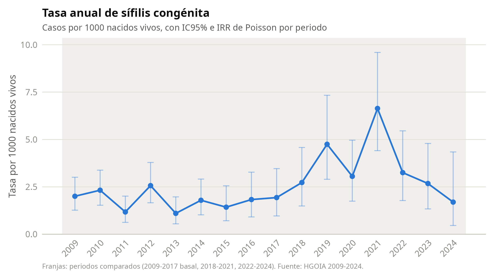
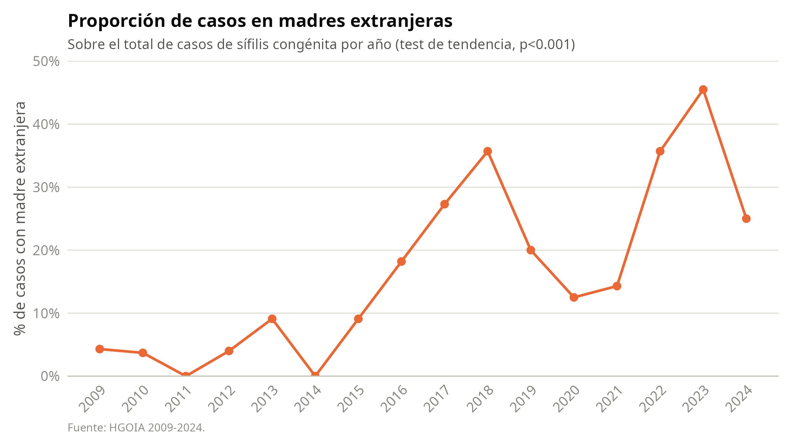
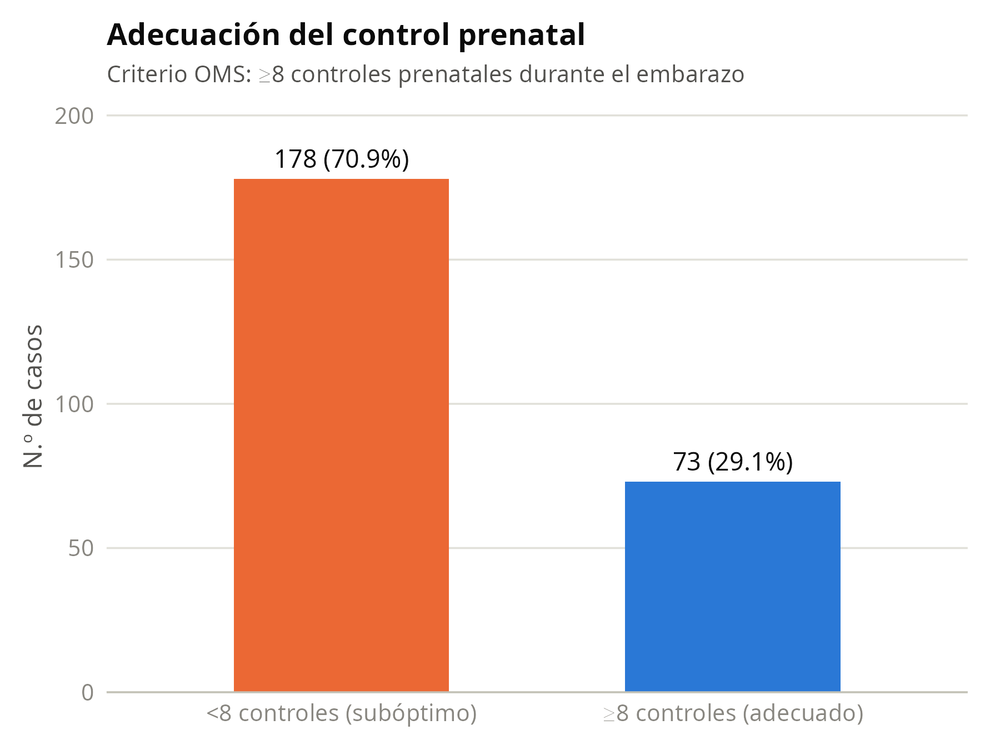

```{r setup, include=FALSE}
knitr::opts_chunk$set(echo = FALSE, warning = FALSE, message = FALSE)

suppressMessages({
  library(dplyr)
  library(readr)
  library(flextable)
  library(knitr)
})

set_flextable_defaults(font.size = 10, font.family = "Calibri",
                        border.color = "#c3c2b7", padding = 4)

tabla_word <- function(df, titulo = NULL) {
  ft <- flextable(df) %>%
    theme_booktabs() %>%
    bold(part = "header") %>%
    align(align = "left", part = "all") %>%
    autofit()
  if (!is.null(titulo)) ft <- set_caption(ft, titulo)
  ft
}

tasas          <- read_csv("output/tasas_anuales.csv", show_col_types = FALSE)
periodos       <- read_csv("output/comparacion_periodos.csv", show_col_types = FALSE)
extranjeras    <- read_csv("output/tendencia_extranjeras.csv", show_col_types = FALSE)
cpn            <- read_csv("output/adecuacion_cpn.csv", show_col_types = FALSE)
basal          <- read_csv("output/tabla_caracteristicas_basales.csv", show_col_types = FALSE)
test_tendencia <- readRDS("output/test_tendencia_extranjeras.rds")

casos_total_global       <- sum(tasas$casos_total)
nacimientos_total_global <- sum(tasas$nacimientos_total)
tasa_global               <- 1000 * casos_total_global / nacimientos_total_global
p_ic <- poisson.test(casos_total_global, nacimientos_total_global / 1000)

fmt1 <- function(x) formatC(x, format = "f", digits = 1)
fmt2 <- function(x) formatC(x, format = "f", digits = 2)
fmtp <- function(p) ifelse(p < 0.001, "<0.001", formatC(p, format = "f", digits = 3))

periodo_basal <- periodos %>% filter(periodo == "2009-2017")
periodo_2 <- periodos %>% filter(periodo == "2018-2021")
periodo_3 <- periodos %>% filter(periodo == "2022-2024")
```

# Introducción

La sífilis congénita continúa siendo un problema prevenible de salud pública y
un marcador de brechas en el tamizaje prenatal, el tratamiento materno oportuno
y el seguimiento perinatal. El objetivo de este análisis fue describir la
tendencia temporal de la sífilis congénita en un hospital de referencia de
Ecuador (HGOIA) entre 2009 y 2024, evaluar los cambios en la composición por
nacionalidad materna y caracterizar la adecuación del control prenatal.

# Métodos

## Diseño y población

Estudio retrospectivo descriptivo de todos los casos de sífilis congénita
diagnosticados en el HGOIA entre 2009 y 2024 (n = `r casos_total_global`
casos). El desenlace de inclusión (`BEBE.sifilis.congenita = 1`) es el criterio
diagnóstico de la cohorte, no una variable observada con variabilidad interna.

## Fuentes de datos y denominadores

Los numeradores (casos) provienen de la base individual de casos de sífilis
congénita del HGOIA (`SIFILIS_hgoia2009-2024.csv`, 255 registros, un caso por
fila). Los denominadores (nacidos vivos anuales, totales y por nacionalidad
materna) provienen de la base de partos por país de origen
(`Partos_pais_origen_2014-2025_HGOIA.csv`, formato ancho por país × año
2009-2024). Ambas bases fueron auditadas de forma cruzada y automatizada
(`R/01_auditoria_datos.R`): la suma de partos por país individual coincide
exactamente con la fila resumen "Total extranjeras" en los 16 años (diferencia
= 0), y no se detectaron inconsistencias internas. El total de nacidos vivos
del periodo 2009-2024 es
`r format(nacimientos_total_global, big.mark = ".", decimal.mark = ",")`
(detalle anual en la Tabla A1 del anexo); esta cifra, derivada directamente de
las bases vigentes, es la fuente única de denominadores para todo el
análisis.

## Definiciones operativas

A partir de la auditoría exhaustiva del diccionario de variables de la base de
casos (`R/02_diccionario_y_auditoria_variables.R`, 74 variables), se
identificaron pares de variables clínicamente relacionadas pero no idénticas.
Se fijaron las siguientes definiciones operativas para este análisis:

- **Trastorno hipertensivo del embarazo**: `TRASTORNOS.HIPERTENSIVOS.CATEGORIA`
  (diagnóstico categorizado del embarazo actual), en lugar de
  `Preclampsia.personal` (discordante en 36/253 casos, posible antecedente de
  embarazos previos).
- **Restricción de crecimiento fetal**: categoría "pequeño" de
  `PESO.EG.CATEGORIA` (clasificación peso/edad gestacional), en lugar del
  diagnóstico clínico `RCIU` (discordante en 5 casos).
- **Defecto congénito**: `Defectos.congenitos.CODIGO`, variable binaria
  (presente/ausente), en lugar de la desagregación por sistema afectado
  (`SISTEMA.AFECTADO`), que fragmenta los 21 casos positivos en categorías con
  n ≤ 7.

## Adecuación del control prenatal

Se clasificó la adecuación del control prenatal según la recomendación vigente
de la OMS: **subóptimo** si el número de consultas prenatales registradas fue
menor a 8, y **adecuado** si fue de 8 o más.

## Periodos de comparación

Se compararon tres periodos, definidos a priori según la evolución observada
del fenómeno: 2009-2017 (periodo basal), 2018-2021 y 2022-2024.

## Análisis estadístico

Las variables continuas se describen con mediana y rango intercuartílico
(RIC); las categóricas, con frecuencia absoluta y porcentaje. Las tasas
anuales y por periodo se expresaron por 1000 nacidos vivos, con intervalos de
confianza del 95% (IC95%) exactos de Poisson. La comparación entre periodos se
realizó mediante regresión de Poisson con offset del logaritmo de los nacidos
vivos, tomando 2009-2017 como categoría de referencia, y se reporta como razón
de tasas de incidencia (IRR) con IC95% y valor de p. La tendencia temporal de
la proporción de casos en madres extranjeras se evaluó con una prueba de
tendencia para proporciones (chi-cuadrado de tendencia lineal). Todos los
análisis se realizaron en R.

\newpage

# Resultados

## Características generales de la cohorte

Se identificaron `r casos_total_global` casos de sífilis congénita entre
`r format(nacimientos_total_global, big.mark=".", decimal.mark=",")` nacidos
vivos en el periodo 2009-2024, para una tasa global de
`r fmt2(tasa_global)` por 1000 nacidos vivos (IC95%
`r fmt2(p_ic$conf.int[1])`–`r fmt2(p_ic$conf.int[2])`).

```{r tabla-basal}
tabla_word(basal %>% rename(Variable = variable, `n (%) / mediana [RIC]` = valor),
           "Tabla 1. Características de los 255 casos de sífilis congénita, HGOIA 2009-2024")
```

## Tendencia temporal de la tasa anual

```{r fig1, fig.cap="Figura 1. Tasa anual de sífilis congénita por 1000 nacidos vivos, HGOIA 2009-2024.", out.width="100%"}

```

La tasa anual alcanzó su máximo en 2021, con
`r tasas$casos_total[tasas$anio == 2021]` casos y
`r fmt2(tasas$tasa_x1000[tasas$anio == 2021])` por 1000 nacidos vivos.

```{r tabla-periodos}
periodos %>%
  transmute(
    Periodo = periodo,
    `Años` = anios,
    Casos = casos_total,
    `Nacidos vivos` = format(nacimientos_total, big.mark = ".", decimal.mark = ","),
    `Tasa x1000 (IC95%)` = sprintf("%s (%s-%s)", fmt2(tasa_x1000), fmt2(ic95_inf_tasa), fmt2(ic95_sup_tasa)),
    `IRR (IC95%)` = ifelse(is.na(irr), "1,00 (referencia)",
                            sprintf("%s (%s-%s)", fmt2(irr), fmt2(ic95_inf_irr), fmt2(ic95_sup_irr))),
    `Valor p` = ifelse(is.na(p_valor), "-", fmtp(p_valor))
  ) %>%
  tabla_word("Tabla 2. Comparación de la tasa de sífilis congénita por periodo (referencia: 2009-2017)")
```

En comparación con 2009-2017, el periodo 2018-2021 mostró un aumento
significativo de la tasa (IRR `r fmt2(periodo_2$irr)`; IC95%
`r fmt2(periodo_2$ic95_inf_irr)`-`r fmt2(periodo_2$ic95_sup_irr)`;
p`r fmtp(periodo_2$p_valor)`), mientras que 2022-2024 no difirió
significativamente del periodo basal (IRR `r fmt2(periodo_3$irr)`; IC95%
`r fmt2(periodo_3$ic95_inf_irr)`-`r fmt2(periodo_3$ic95_sup_irr)`;
p`r fmtp(periodo_3$p_valor)`).

## Cambios en la composición por nacionalidad materna

```{r fig2, fig.cap="Figura 2. Proporción de casos de sífilis congénita en madres extranjeras, HGOIA 2009-2024.", out.width="100%"}

```

La proporción de casos en hijos de madres extranjeras aumentó de
`r fmt1(extranjeras$pct_extranjeras[extranjeras$anio == 2009])`% en 2009 a un
máximo de `r fmt1(max(extranjeras$pct_extranjeras))`% en
`r extranjeras$anio[which.max(extranjeras$pct_extranjeras)]`
(prueba de tendencia, p`r fmtp(test_tendencia$p.value)`).

## Adecuación del control prenatal

```{r fig3, fig.cap="Figura 3. Adecuación del control prenatal (criterio OMS: ≥8 controles).", out.width="70%"}

```

```{r tabla-cpn}
cpn %>%
  mutate(adecuacion = ifelse(is.na(adecuacion), "Sin dato", adecuacion)) %>%
  rename(`Adecuación del control prenatal` = adecuacion, n = n, `%` = pct) %>%
  tabla_word("Tabla 3. Adecuación del control prenatal, HGOIA 2009-2024")
```

El `r fmt1((cpn %>% filter(adecuacion == "<8 controles (subóptimo)"))$pct)`%
de las gestantes tuvo un control prenatal subóptimo (<8 consultas).

# Conclusiones preliminares

La sífilis congénita mostró un incremento temporal importante entre 2018 y
2021, con pico en 2021 y descenso posterior. Este patrón se acompañó de una
alta frecuencia de control prenatal subóptimo y de cambios en la composición
por nacionalidad materna, con una proporción creciente de casos en madres
extranjeras. Estos hallazgos son preliminares y están sujetos a la
interpretación clínica del investigador principal.

\newpage

# Anexo. Tabla completa de tasas anuales

```{r tabla-anexo}
tasas %>%
  transmute(
    Año = as.character(anio), Casos = casos_total,
    `Nacidos vivos` = format(nacimientos_total, big.mark = ".", decimal.mark = ","),
    `Tasa x1000 (IC95%)` = sprintf("%s (%s-%s)", fmt2(tasa_x1000), fmt2(ic95_inf), fmt2(ic95_sup))
  ) %>%
  tabla_word("Tabla A1. Tasa anual de sífilis congénita por 1000 nacidos vivos, con IC95% exacto de Poisson")
```
